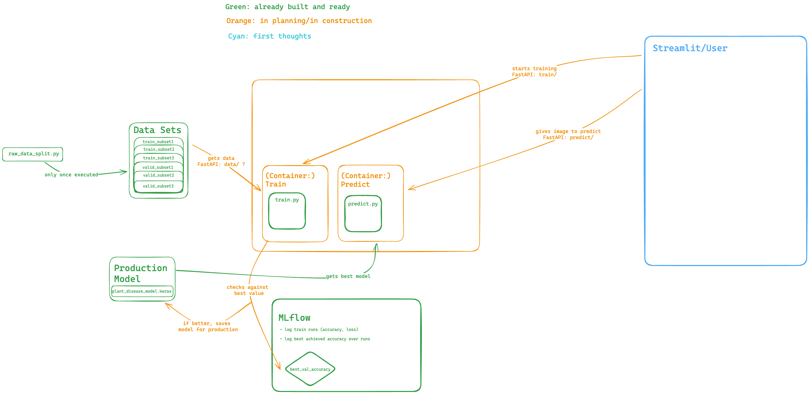

# 🌱 Deep Leaf - Plant Disease Classification MLOps Pipeline

## Work in progress

Project was done during training at [DataScientest.com](DataScientest.com) together with [@schytze0](https://github.com/schytze0), [@94O-O-O-O-O49](https://github.com/94O-O-O-O-O49), and [@Nielsvd06](https://github.com/Nielsvd06).

## 📌 Overview
**Deep Leaf** is a deep learning-based **image classification pipeline** for detecting plant diseases using **Transfer Learning (VGG16)**. It follows **MLOps best practices**, enabling:
- **Automated dataset handling from Kaggle**
- **Efficient model training & logging**

## 📂 Repository Structure
| File/Folder            | Description |
|------------------------|-------------|
| `src/config.py`           | Stores **global configuration** (paths, credentials, model settings). |
| `src/raw_data_split.py`      | Handles **dataset downloading & preprocessing**. |
| `src/model.py`            | Defines the **VGG16 transfer learning model**. |
| `src/train.py`            | **Trains the model** in two phases and saves training history. |
| `src/predict.py`          | **Makes predictions** on single images or folders. |
| `src/utils.py`            | Loads & **plots training history** (accuracy & loss). |
| `requirements.txt`    | Lists **dependencies** for setting up the environment. |
| `mac-requirements.txt`    | Lists **dependencies** for setting up the environment with Mac (Silicon, GPU use). |
| `logs/` _(Folder)_    | Stores **training history (`history_*.json`)**. |
| `models/` _(Folder)_  | Stores **trained models (`.keras`)**. (handled with DVC) |
| `data/` _(Folder)_  | Stores **data**. (handled with DVC) |
| `.dvc/` _(Folder)_  | DVC configuration folder |

## Architecture so far

